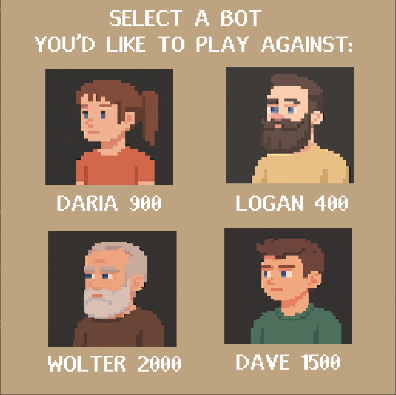
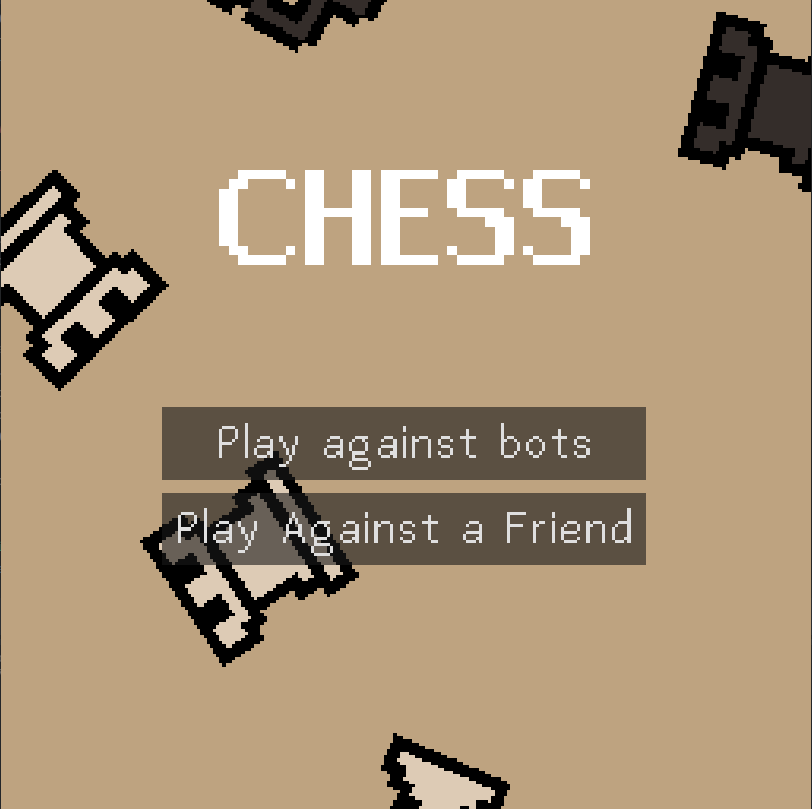
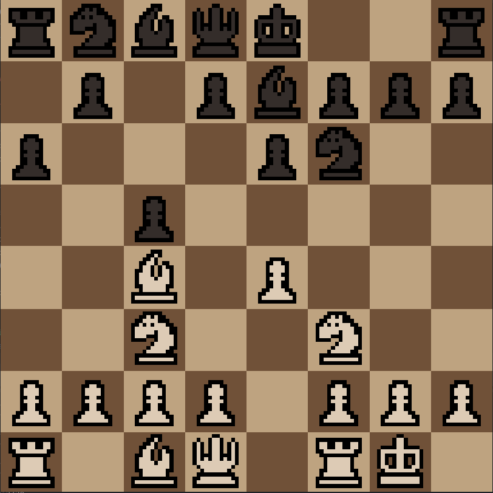

# ♟️ Godot Chess (Multiplayer + Stockfish)

An online chess game built with **Godot 4**, **Firebase Realtime Database**, and **Stockfish AI** hosted on Render.
Supports real-time 1v1 multiplayer and matches against a powerful AI opponent.

---

## 🚀 Features

- ✅ Two-player online multiplayer
- ✅ Stockfish AI opponent (via Render-hosted API)
- ✅ Realtime updates using Firebase (no polling)
- ✅ Piece capture animation and smooth UI
- ✅ Built entirely with Godot 4 (GDScript)

---

## 🧠 Tech Stack

| Feature               | Tech Used                          |
|----------------------|------------------------------------|
| Game Engine          | Godot 4.x                          |
| Multiplayer Backend  | Firebase Realtime Database         |
| AI Engine            | Stockfish (via REST API on Render) |
| Streaming            | SSE (Server-Sent Events) with `HTTPClient` |

---

## 📸 Screenshots





---

## 🛠️ Setup Instructions

### 1. Clone this repo
```bash
git clone https://github.com/baricoh1/godot-chess.git
cd godot-chess
```

### 2. Open in Godot 4
Make sure you're using **Godot 4.x**. Open the project in the Godot editor.

### 3. Set your Firebase URL
In `MultiplayerManager.gd`, update this line:
```gdscript
const FIREBASE_HOST = "<your-firebase-db>.firebaseio.com"
```
### 4. Stockfish AI (optional)
Deploy the `stockfish_server` to **Render** or any other cloud platform. Make sure the URL is set in your AI node script.
In `CloudStockfishBot.gd`, update this line:
```gdscript
var url = "https://<your-render-stockfish-server-url>/move"  # ← replace this with your own
```


---

## 🎮 How to Play

- Click "Create Room" to host a match
- Click "Join Room" to enter a game with a room code
- Or play against the AI bot directly

---

## 📦 Folder Structure (Key Files)

```
/scenes/
  ├─ main_menu.tscn
  ├─ game.tscn
/scripts/
  ├─ MultiplayerManager.gd
  ├─ StockfishBot.gd
  └─ CapturedUI.gd
```

---

## 📜 License
MIT – do whatever you want, just give credit.

---

## 🤝 Credits
- Developed by **[Your Name]**
- Stockfish engine: https://stockfishchess.org/
- Firebase Realtime DB by Google

---

Want to contribute? PRs welcome!
